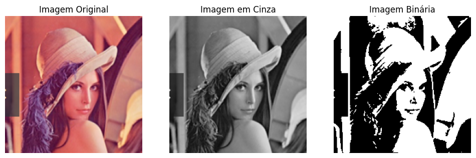

# Desafio - Binarização de Imagens

Este repositório contém a solução do desafio proposto em aula: implementar em Python a conversão de uma imagem colorida para:

1. **Escala de cinza** (0 a 255)
2. **Imagem binária** (0 ou 255)

## 📌 Tecnologias
- Python
- OpenCV
- Matplotlib

## 🚀 Execução
1. Clone este repositório:
   ```bash
   git clone https://github.com/seu-usuario/desafio-binarizacao.git

2.Abra o notebook binarizacao_imagens.ipynb no Colab ou Jupyter.

3.Faça upload da imagem que deseja transformar e rode as células.

📊 Resultados


👩‍💻 Autoria
**Enaile Lopes**
Projeto desenvolvido como parte do Bootcamp bairesdev machine learning
